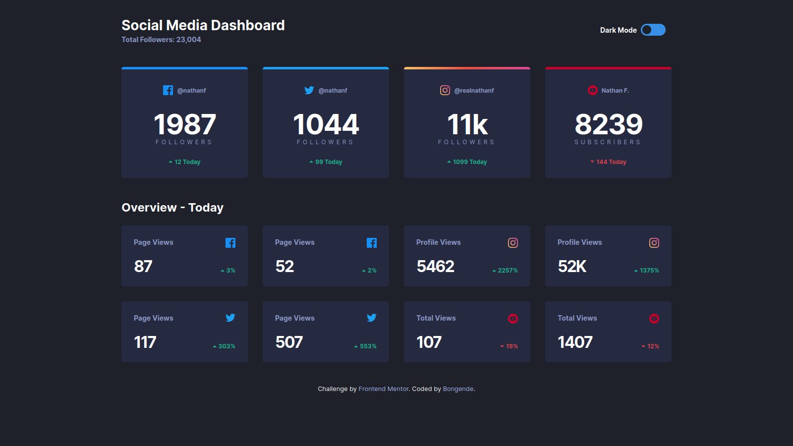
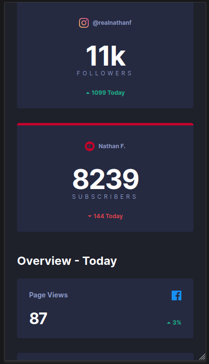

# Frontend Mentor - Social media dashboard with theme switcher solution

Table of contents

- [Overview](#Overview "Overview")
  - [The challenge](#the-challenge)
  - [Screenshot](#screenshot)
  - [Links](#overview)
- [My process](#my-process)
  - [Built with](#built-with)
  - [What I learned](#what-i-learned)
  - [Continued development](#continued-development)
  - [Useful resources](#useful-resources)
- [Author](#author)
- [Acknowledgments](#acknowledgments)

## Overview

### The challenge

Users should be able to:

- View the optimal layout for the site depending on their device's screen size
- See hover states for all interactive elements on the page
- Toggle color theme to their preference

### Screenshot

Links

- [Solution URL](https://github.com/bongende/social-media-dashboard-with-theme-switcher-master.git)
- [Live Site URL](https://socialmediadashboard.christobongende.repl.co)

## My process

### Built with

- Semantic HTML5 markup
- CSS custom properties
- Flexbox
- CSS Grid
- Mobile-first workflow
- Javascript
- Sass/Scss

### What I learned

I learn more on Scss, and the `matchMedia` function in javascript, and much more on accebility, much, i really learn to be focus on the accebility

### Continued development

Use this section to outline areas that you want to continue focusing on in future projects. These could be concepts you're still not completely comfortable with or techniques you found useful that you want to refine and perfect.

### Useful resources

- more of the ressources are on the `notes.md` file above
- This [Coder Coder Playlist](https://www.youtube.com/playlist?list=PLUWqFDiirlsu5az5EIyxe8ZddyNO_kDuP) was very hepfull for me and it teach in a cool form, i think, the sass and scss aproach.
- this [CSS-tricks](https://css-tricks.com/snippets/css/complete-guide-grid/) page has good informations about css grid.

## Author

- Linkedin - [Christopher Duwa](https://www.linkedin.com/in/christopherduwa/)
- Frontend Mentor - [@ChristoBongende](https://www.frontendmentor.io/profile/bongende)
- Twitter - [@0505_Christo](https://twitter.com/0505_Christo)
